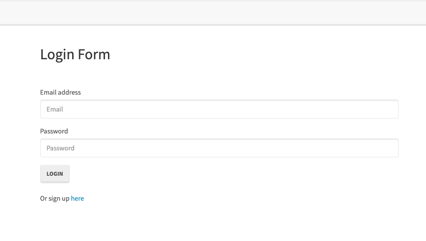
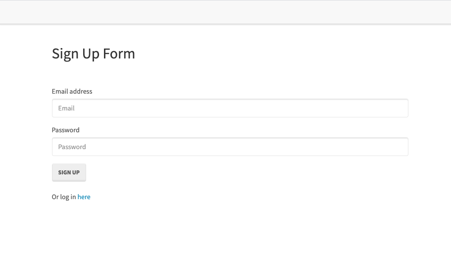
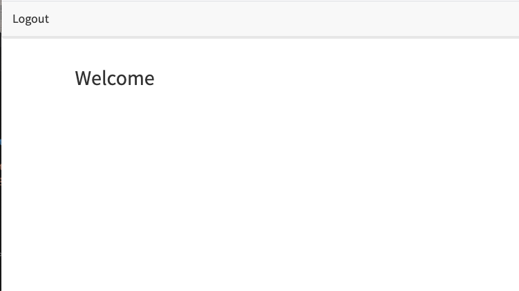

# Walk This Way

## Description

This is the fourteenth assigment from the UConn Coding Boot Camp curriculum. We have covered the following topics thus far: Git, Terminal, GitHub, GitHub Pages, Web Accessibility, HTML, CSS, JavaScript, jQuery, Bootstrap, DOM Traversal, Web APIs, Third-Party APIs, Server-Side APIs, Node.js, Inquirer.js, and Express.js.

Within the last two weeks the following topics have been introduced: MySQL database management system (DBMS) - the most popular Structured Query Language (SQL) relational database, MySQL Shell, Model-View-Controller (MVC) design pattern framework, Handlebars.js template engine, Object Relational-Mapping (ORM) to create resuable methods for querying our database.

View the tutorial [here](https://docs.google.com/document/d/10Jxgv8h8c__baKuJjWcf0DKAJv9Q0WI0B08-tB-BrUU/edit?usp=sharing)

## Table of Contents

- [Goals](#goals)
- [Instructions](#instructions)
- [Starter Code](#starter-code)
- [User Story](#user-story)
- [Acceptance Criteria](#acceptance-criteria)
- [Business Context](#business-context)
- [Installation](#installation)
- [Usage](#usage)
- [Credits](#credits)
- [License](#license)

## Goals

1. Inspect starter code within the `Develop` folder.

2. Get an understanding of each file's responsibility.

3. Create a GoogleDoc

4. Write a tutorial explaining _every_ file and its purpose [in GoogleDoc] .

5. Add instructions for how you could add changes to it [at end of tutorial in GoogleDoc].

## Instructions

Reverse engineer the starter code provided and create a tutorial for the code.

In the Develop folder, there is starter code for a project. Begin inspecting the code to get an understanding of each file's responsibility. Then, in a Google Doc, write a tutorial explaining every file and its purpose. If one file is dependant on other files, be sure to let the user know.

At the end of the tutorial, add instructions for how you could now add changes to this project.

### Starter code:

```
.Develop
|
├── config
│   └── middleware
|    |  ├── isAuthenticated.js
|    ├── config.json
|    └── passport.js
│
├── models
│   └── index.js
|   └── user.js
│
├── public
│   └── js
|   |   ├────login.js
|   |   ├──── members.js
|   |   └──── signup.js
|   └── stylesheets
│       └── style.css
│
├── routes
|    ├── api-routes.js
|    └── html-routes.js
│
├── (node_modules)
├── (.gitignore)
├── (package-lock.json)
|
├── package.json
|
├── server.js
│

```

### User Story

```
AS A developer
I WANT a walk-through of the codebase
SO THAT I can use it as a starting point for a new project

```

### Acceptance Criteria

The application must meet the following requirements:

```
GIVEN a Node.js application using Sequelize and Passport
WHEN I follow the walkthrough
THEN I understand the codebase

```

### Business Context

When joining a new team, you will be expected to inspect a lot of code that you have never seen before. Rather than having a team member explain every line for you, you will dissect the code by yourself, saving any questions for a member of your team.

## Installation

1. create `.gitignore` file and add `node_modules` and `.DS_Store`
2. npm install (npm install all packages)
3. change your password in `config.json`
4. run `node server.js` in terminal

## Usage







## Credits

Reference articles: see footnotes in GoogleDoc.

## License

[MIT](MITLicense.txt)

---

© 2021 Trilogy Education Services, LLC, a 2U, Inc. brand. Confidential and Proprietary. All Rights Reserved.
